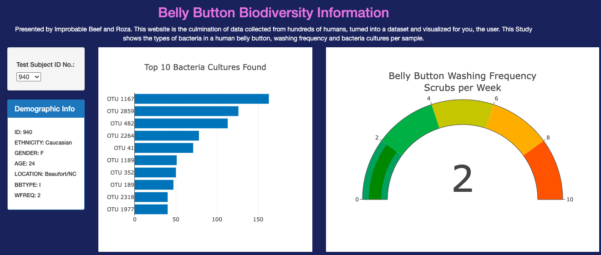

# Belly_Button_Biodiversity
## Devin Monsen
### 10/06/2022

---
**Overview of Project**
---
This project is a dashboard webpage that takes in a json data file and creates plotly visualizations off of it. The dataset contained a list of test subjects, and my goal was to find the types of microbes found in their "belly buttons". Then I created 4 different types of interactive charts to display information. First being the demographic info which provides the test subjects: 
- ID: 
- ETHNICITY: 
- GENDER:
- AGE: 
- LOCATION: 
- Belly Button TYPE: 
- Washing Frequency:

Next step was the top 10 bacteria's found in that given test subject. These are labeled as OSU #(operational taxonomic units) to keep track of bacteria types. Thirdly, I created a gauge plot that would display the clients washing frequency. And lastly, a "bacteria per sample" bubble chart.

## Tools For Development

### Libraries
- d3.js 7.6.1
- Plotly.js  5.13.1

### Code
- JavaScript
- HTML
- CSS
